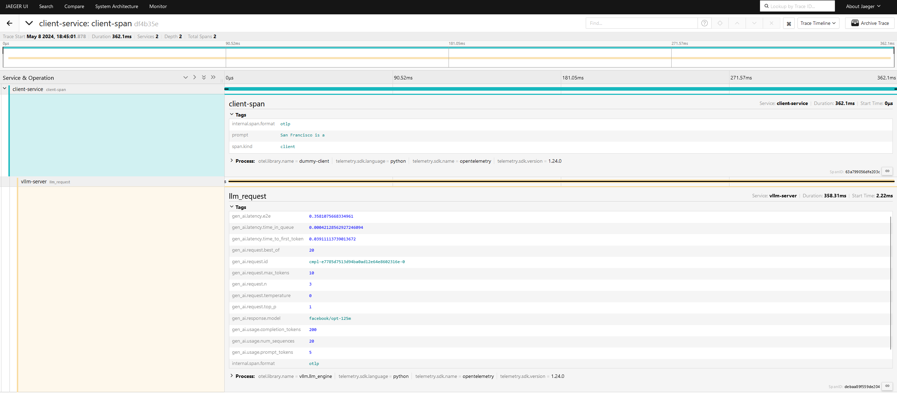
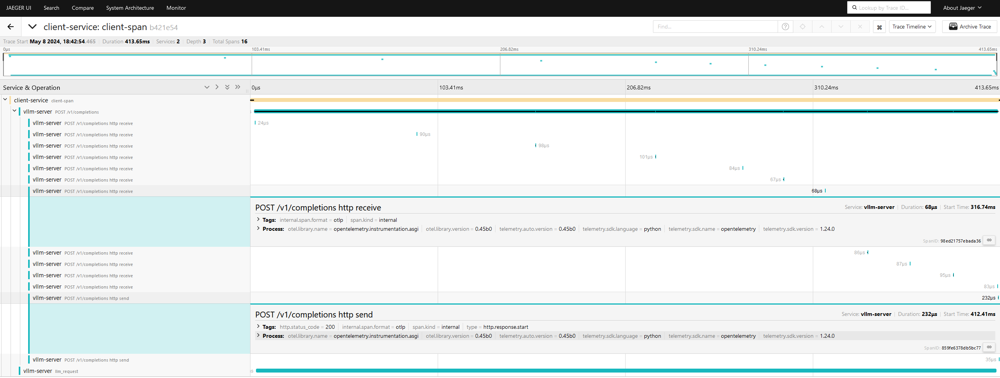

[*在线运行 vLLM 入门教程：零基础分步指南](https://openbayes.com/console/public/tutorials/rXxb5fZFr29?utm_source=vLLM-CNdoc&utm_medium=vLLM-CNdoc-V1&utm_campaign=vLLM-CNdoc-V1-25ap)

源码 [examples/online_serving/opentelemetry](https://github.com/vllm-project/vllm/blob/main/examples/online_serving/opentelemetry)

1. 安装 OpenTelemetry 包

    ```console
    pip install \
      'opentelemetry-sdk>=1.26.0,<1.27.0' \
      'opentelemetry-api>=1.26.0,<1.27.0' \
      'opentelemetry-exporter-otlp>=1.26.0,<1.27.0' \
      'opentelemetry-semantic-conventions-ai>=0.4.1,<0.5.0'
    ```


2. 在 Docker 容器中启动 Jaeger
    ```console
    # From: https://www.jaegertracing.io/docs/1.57/getting-started/
    # 参考: https://www.jaegertracing.io/docs/1.57/getting-started/
    docker run --rm --name jaeger \
        -e COLLECTOR_ZIPKIN_HOST_PORT=:9411 \
        -p 6831:6831/udp \
        -p 6832:6832/udp \
        -p 5778:5778 \
        -p 16686:16686 \
        -p 4317:4317 \
        -p 4318:4318 \
        -p 14250:14250 \
        -p 14268:14268 \
        -p 14269:14269 \
        -p 9411:9411 \
        jaegertracing/all-in-one:1.57
    ```

3. 在新终端中导入 Jaeger IP
    ```console
    export JAEGER_IP=$(docker inspect   --format '{{ .NetworkSettings.IPAddress }}' jaeger)
    export OTEL_EXPORTER_OTLP_TRACES_ENDPOINT=grpc://$JAEGER_IP:4317
    ```

    Then set vLLM's service name for OpenTelemetry, enable insecure connections to Jaeger and run vLLM:

    设置 vLLM 的 OpenTelemetry 服务名称， 启用与 Jaeger 的非安全连接并启动 vLLM 服务:

    ```console
    export OTEL_SERVICE_NAME="vllm-server"
    export OTEL_EXPORTER_OTLP_TRACES_INSECURE=true
    vllm serve facebook/opt-125m --otlp-traces-endpoint="$OTEL_EXPORTER_OTLP_TRACES_ENDPOINT"
    ```


4. 在新终端中从虚拟客户端发生请求，携带跟踪内容

    ```console
    export JAEGER_IP=$(docker inspect --format '{{ .NetworkSettings.IPAddress }}' jaeger)
    export OTEL_EXPORTER_OTLP_TRACES_ENDPOINT=grpc://$JAEGER_IP:4317
    export OTEL_EXPORTER_OTLP_TRACES_INSECURE=true
    export OTEL_SERVICE_NAME="client-service"
    python dummy_client.py
    ```

5. 打开 Jaeger 网页界面：http://localhost:16686/


    在搜索面板中，选择 vllm-server 服务并点击 Find Traces。您将看到一系列追踪记录，每个请求对应一条记录。


6. 点击某条追踪记录将显示其包含的 spans 及其标签。在本演示中，每条追踪包含 2 个 spans：一个来自模拟客户端（包含提示文本），另一个来自 vLLM（包含请求元数据）。
   


## 导出器协议

OpenTelemetry 支持两种导出器协议传输追踪数据：`grpc` 或 `http/protobuf`。
默认使用 `grpc`。要设置为 `http/protobuf` 协议，请按如下方式配置 `OTEL_EXPORTER_OTLP_TRACES_PROTOCOL` 环境变量：

```console
export OTEL_EXPORTER_OTLP_TRACES_PROTOCOL=http/protobuf
export OTEL_EXPORTER_OTLP_TRACES_ENDPOINT=http://$JAEGER_IP:4318/v1/traces
vllm serve facebook/opt-125m --otlp-traces-endpoint="$OTEL_EXPORTER_OTLP_TRACES_ENDPOINT"
```

## astAPI 自动埋点

OpenTelemetry 支持 FastAPI 的自动埋点功能。

1. 安装埋点库

    ```console
    pip install opentelemetry-instrumentation-fastapi
    ``` 

2. 使用 opentelemetry-instrument 运行 vLLM

    ```console
    opentelemetry-instrument vllm serve facebook/opt-125m
    ```

3. 向 vLLM 发送请求并在 Jaeger 中查找其追踪记录。该记录应包含来自 FastAPI 的 spans。




# 示例材料
## dummy_client.py
```python
# SPDX-License-Identifier: Apache-2.0

import requests
from opentelemetry.exporter.otlp.proto.grpc.trace_exporter import (
    OTLPSpanExporter)
from opentelemetry.sdk.trace import TracerProvider
from opentelemetry.sdk.trace.export import (BatchSpanProcessor,
                                            ConsoleSpanExporter)
from opentelemetry.trace import SpanKind, set_tracer_provider
from opentelemetry.trace.propagation.tracecontext import (
    TraceContextTextMapPropagator)

trace_provider = TracerProvider()
set_tracer_provider(trace_provider)

trace_provider.add_span_processor(BatchSpanProcessor(OTLPSpanExporter()))
trace_provider.add_span_processor(BatchSpanProcessor(ConsoleSpanExporter()))

tracer = trace_provider.get_tracer("dummy-client")

url = "http://localhost:8000/v1/completions"
with tracer.start_as_current_span("client-span", kind=SpanKind.CLIENT) as span:
    prompt = "San Francisco is a"
    span.set_attribute("prompt", prompt)
    headers = {}
    TraceContextTextMapPropagator().inject(headers)
    payload = {
        "model": "facebook/opt-125m",
        "prompt": prompt,
        "max_tokens": 10,
        "n": 3,
        "use_beam_search": "true",
        "temperature": 0.0,
        # "stream": True,
    }
    response = requests.post(url, headers=headers, json=payload)
```