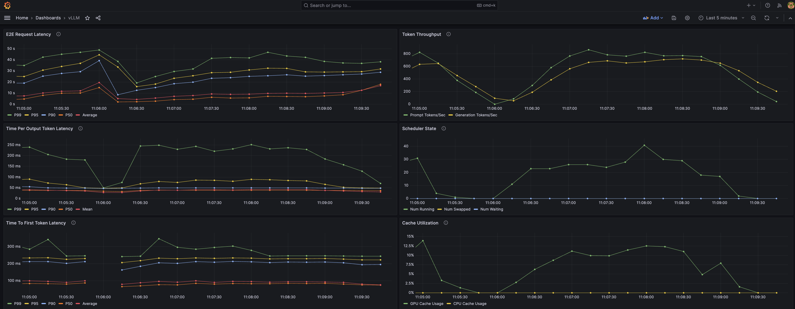

[\*在线运行 vLLM 入门教程：零基础分步指南](https://openbayes.com/console/public/tutorials/rXxb5fZFr29?utm_source=vLLM-CNdoc&utm_medium=vLLM-CNdoc-V1&utm_campaign=vLLM-CNdoc-V1-25ap)

源码 [examples/online_serving/prometheus_grafana](https://github.com/vllm-project/vllm/blob/main/examples/online_serving/prometheus_grafana)

本示例演示如何将 vLLM 的指标数据接入 Prometheus/Grafana 监控栈。本例使用 Docker 启动 Prometheus 和 Grafana 服务，更多部署方式请参考 [Prometheus](https://prometheus.io/) 和 [Grafana](https://grafana.com/) 官方文档。

安装:

- [`docker`](https://docs.docker.com/engine/install/)
- [`docker compose`](https://docs.docker.com/compose/install/linux/#install-using-the-repository)

## 启动

Prometheus 指标日志记录在 OpenAI 兼容服务器中默认启用。通过入口点启动：

```bash
vllm serve mistralai/Mistral-7B-v0.1 \
    --max-model-len 2048 \
    --disable-log-requests
```

使用 `docker compose` 启动 Prometheus 和 Grafana 服务：

```bash
docker compose up
```

向服务器提交样本请求：

```bash
wget https://huggingface.co/datasets/anon8231489123/ShareGPT_Vicuna_unfiltered/resolve/main/ShareGPT_V3_unfiltered_cleaned_split.json

python3 ../../../benchmarks/benchmark_serving.py \
    --model mistralai/Mistral-7B-v0.1 \
    --tokenizer mistralai/Mistral-7B-v0.1 \
    --endpoint /v1/completions \
    --dataset-name sharegpt \
    --dataset-path ShareGPT_V3_unfiltered_cleaned_split.json \
    --request-rate 3.0
```

访问 [`http://localhost:8000/metrics`](http://localhost:8000/metrics) 即可查看 vLLM 暴露的原始 Prometheus 指标数据。

## Grafana 仪表板

访问 [`http://localhost:3000`](http://localhost:3000)，使用默认凭证登录（用户名：admin，密码：admin）。

### 添加数据源

访问 [`http://localhost:3000/connections/datasources/new`](http://localhost:3000/connections/datasources/new) 选择 Prometheus 数据源。

在 Prometheus 配置页面中，您需要在 `Connection` 部分添加 `Prometheus Server URL`。在本示例配置中，Grafana 和 Prometheus 运行于不同的容器，但 Docker 会为每个容器创建 DNS 名称。您可以直接使用 `http://prometheus:9090`。

点击保存并测试 `Save & Test`。您将看到绿色的成功提示，显示 "Successfully queried the Prometheus API."。

### 导入仪表板

Navigate to [`http://localhost:3000/dashboard/import`](http://localhost:3000/dashboard/import), upload `grafana.json`, and select the `prometheus` datasource. You should see a screen that looks like the following:

访问 [`http://localhost:3000/dashboard/import`](http://localhost:3000/dashboard/import)，上传 `grafana.json` 文件，并选择 `prometheus` 数据源。您将看到如下所示的界面：



# 示例材料

## docker-compose.yaml

```yaml
# docker-compose.yaml
version: "3"

services:
  prometheus:
    image: prom/prometheus:latest
    extra_hosts:
      - "host.docker.internal:host-gateway" # allow a direct connection from container to the local machine   # 允许容器直接连接宿主机
    ports:
      - "9090:9090" # the default port used by Prometheus  # Prometheus 默认服务端口
    volumes:
      - ${PWD}/prometheus.yaml:/etc/prometheus/prometheus.yml # mount Prometheus config file # 挂载 Prometheus 配置文件

  grafana:
    image: grafana/grafana:latest
    depends_on:
      - prometheus
    ports:
      - "3000:3000" # the default port used by Grafana # Grafana 默认服务端口
```

## grafana.json

```json
{
  "annotations": {
    "list": [
      {
        "builtIn": 1,
        "datasource": {
          "type": "grafana",
          "uid": "-- Grafana --"
        },
        "enable": true,
        "hide": true,
        "iconColor": "rgba(0, 211, 255, 1)",
        "name": "Annotations & Alerts",
        "target": {
          "limit": 100,
          "matchAny": false,
          "tags": [],
          "type": "dashboard"
        },
        "type": "dashboard"
      }
    ]
  },
  "description": "Monitoring vLLM Inference Server",
  "editable": true,
  "fiscalYearStartMonth": 0,
  "graphTooltip": 0,
  "id": 1,
  "links": [],
  "liveNow": false,
  "panels": [
    {
      "datasource": {
        "type": "prometheus",
        "uid": "${DS_PROMETHEUS}"
      },
      "description": "End to end request latency measured in seconds.",
      "fieldConfig": {
        "defaults": {
          "color": {
            "mode": "palette-classic"
          },
          "custom": {
            "axisBorderShow": false,
            "axisCenteredZero": false,
            "axisColorMode": "text",
            "axisLabel": "",
            "axisPlacement": "auto",
            "barAlignment": 0,
            "barWidthFactor": 0.6,
            "drawStyle": "line",
            "fillOpacity": 0,
            "gradientMode": "none",
            "hideFrom": {
              "legend": false,
              "tooltip": false,
              "viz": false
            },
            "insertNulls": false,
            "lineInterpolation": "linear",
            "lineWidth": 1,
            "pointSize": 5,
            "scaleDistribution": {
              "type": "linear"
            },
            "showPoints": "auto",
            "spanNulls": false,
            "stacking": {
              "group": "A",
              "mode": "none"
            },
            "thresholdsStyle": {
              "mode": "off"
            }
          },
          "mappings": [],
          "thresholds": {
            "mode": "absolute",
            "steps": [
              {
                "color": "green",
                "value": null
              },
              {
                "color": "red",
                "value": 80
              }
            ]
          },
          "unit": "s"
        },
        "overrides": []
      },
      "gridPos": {
        "h": 8,
        "w": 12,
        "x": 0,
        "y": 0
      },
      "id": 9,
      "options": {
        "legend": {
          "calcs": [],
          "displayMode": "list",
          "placement": "bottom",
          "showLegend": true
        },
        "tooltip": {
          "mode": "single",
          "sort": "none"
        }
      },
      "targets": [
        {
          "datasource": {
            "type": "prometheus",
            "uid": "${DS_PROMETHEUS}"
          },
          "disableTextWrap": false,
          "editorMode": "builder",
          "expr": "histogram_quantile(0.99, sum by(le) (rate(vllm:e2e_request_latency_seconds_bucket{model_name=\"$model_name\"}[$__rate_interval])))",
          "fullMetaSearch": false,
          "includeNullMetadata": false,
          "instant": false,
          "legendFormat": "P99",
          "range": true,
          "refId": "A",
          "useBackend": false
        },
        {
          "datasource": {
            "type": "prometheus",
            "uid": "${DS_PROMETHEUS}"
          },
          "disableTextWrap": false,
          "editorMode": "builder",
          "expr": "histogram_quantile(0.95, sum by(le) (rate(vllm:e2e_request_latency_seconds_bucket{model_name=\"$model_name\"}[$__rate_interval])))",
          "fullMetaSearch": false,
          "hide": false,
          "includeNullMetadata": false,
          "instant": false,
          "legendFormat": "P95",
          "range": true,
          "refId": "B",
          "useBackend": false
        },
        {
          "datasource": {
            "type": "prometheus",
            "uid": "${DS_PROMETHEUS}"
          },
          "disableTextWrap": false,
          "editorMode": "builder",
          "expr": "histogram_quantile(0.9, sum by(le) (rate(vllm:e2e_request_latency_seconds_bucket{model_name=\"$model_name\"}[$__rate_interval])))",
          "fullMetaSearch": false,
          "hide": false,
          "includeNullMetadata": false,
          "instant": false,
          "legendFormat": "P90",
          "range": true,
          "refId": "C",
          "useBackend": false
        },
        {
          "datasource": {
            "type": "prometheus",
            "uid": "${DS_PROMETHEUS}"
          },
          "disableTextWrap": false,
          "editorMode": "builder",
          "expr": "histogram_quantile(0.5, sum by(le) (rate(vllm:e2e_request_latency_seconds_bucket{model_name=\"$model_name\"}[$__rate_interval])))",
          "fullMetaSearch": false,
          "hide": false,
          "includeNullMetadata": false,
          "instant": false,
          "legendFormat": "P50",
          "range": true,
          "refId": "D",
          "useBackend": false
        },
        {
          "datasource": {
            "type": "prometheus",
            "uid": "${DS_PROMETHEUS}"
          },
          "editorMode": "code",
          "expr": "rate(vllm:e2e_request_latency_seconds_sum{model_name=\"$model_name\"}[$__rate_interval])\n/\nrate(vllm:e2e_request_latency_seconds_count{model_name=\"$model_name\"}[$__rate_interval])",
          "hide": false,
          "instant": false,
          "legendFormat": "Average",
          "range": true,
          "refId": "E"
        }
      ],
      "title": "E2E Request Latency",
      "type": "timeseries"
    },
    {
      "datasource": {
        "type": "prometheus",
        "uid": "${DS_PROMETHEUS}"
      },
      "description": "Number of tokens processed per second",
      "fieldConfig": {
        "defaults": {
          "color": {
            "mode": "palette-classic"
          },
          "custom": {
            "axisBorderShow": false,
            "axisCenteredZero": false,
            "axisColorMode": "text",
            "axisLabel": "",
            "axisPlacement": "auto",
            "barAlignment": 0,
            "barWidthFactor": 0.6,
            "drawStyle": "line",
            "fillOpacity": 0,
            "gradientMode": "none",
            "hideFrom": {
              "legend": false,
              "tooltip": false,
              "viz": false
            },
            "insertNulls": false,
            "lineInterpolation": "linear",
            "lineWidth": 1,
            "pointSize": 5,
            "scaleDistribution": {
              "type": "linear"
            },
            "showPoints": "auto",
            "spanNulls": false,
            "stacking": {
              "group": "A",
              "mode": "none"
            },
            "thresholdsStyle": {
              "mode": "off"
            }
          },
          "mappings": [],
          "thresholds": {
            "mode": "absolute",
            "steps": [
              {
                "color": "green",
                "value": null
              },
              {
                "color": "red",
                "value": 80
              }
            ]
          }
        },
        "overrides": []
      },
      "gridPos": {
        "h": 8,
        "w": 12,
        "x": 12,
        "y": 0
      },
      "id": 8,
      "options": {
        "legend": {
          "calcs": [],
          "displayMode": "list",
          "placement": "bottom",
          "showLegend": true
        },
        "tooltip": {
          "mode": "single",
          "sort": "none"
        }
      },
      "targets": [
        {
          "datasource": {
            "type": "prometheus",
            "uid": "${DS_PROMETHEUS}"
          },
          "disableTextWrap": false,
          "editorMode": "builder",
          "expr": "rate(vllm:prompt_tokens_total{model_name=\"$model_name\"}[$__rate_interval])",
          "fullMetaSearch": false,
          "includeNullMetadata": false,
          "instant": false,
          "legendFormat": "Prompt Tokens/Sec",
          "range": true,
          "refId": "A",
          "useBackend": false
        },
        {
          "datasource": {
            "type": "prometheus",
            "uid": "${DS_PROMETHEUS}"
          },
          "disableTextWrap": false,
          "editorMode": "builder",
          "expr": "rate(vllm:generation_tokens_total{model_name=\"$model_name\"}[$__rate_interval])",
          "fullMetaSearch": false,
          "hide": false,
          "includeNullMetadata": false,
          "instant": false,
          "legendFormat": "Generation Tokens/Sec",
          "range": true,
          "refId": "B",
          "useBackend": false
        }
      ],
      "title": "Token Throughput",
      "type": "timeseries"
    },
    {
      "datasource": {
        "type": "prometheus",
        "uid": "${DS_PROMETHEUS}"
      },
      "description": "Inter token latency in seconds.",
      "fieldConfig": {
        "defaults": {
          "color": {
            "mode": "palette-classic"
          },
          "custom": {
            "axisBorderShow": false,
            "axisCenteredZero": false,
            "axisColorMode": "text",
            "axisLabel": "",
            "axisPlacement": "auto",
            "barAlignment": 0,
            "barWidthFactor": 0.6,
            "drawStyle": "line",
            "fillOpacity": 0,
            "gradientMode": "none",
            "hideFrom": {
              "legend": false,
              "tooltip": false,
              "viz": false
            },
            "insertNulls": false,
            "lineInterpolation": "linear",
            "lineWidth": 1,
            "pointSize": 5,
            "scaleDistribution": {
              "type": "linear"
            },
            "showPoints": "auto",
            "spanNulls": false,
            "stacking": {
              "group": "A",
              "mode": "none"
            },
            "thresholdsStyle": {
              "mode": "off"
            }
          },
          "mappings": [],
          "thresholds": {
            "mode": "absolute",
            "steps": [
              {
                "color": "green",
                "value": null
              },
              {
                "color": "red",
                "value": 80
              }
            ]
          },
          "unit": "s"
        },
        "overrides": []
      },
      "gridPos": {
        "h": 8,
        "w": 12,
        "x": 0,
        "y": 8
      },
      "id": 10,
      "options": {
        "legend": {
          "calcs": [],
          "displayMode": "list",
          "placement": "bottom",
          "showLegend": true
        },
        "tooltip": {
          "mode": "single",
          "sort": "none"
        }
      },
      "targets": [
        {
          "datasource": {
            "type": "prometheus",
            "uid": "${DS_PROMETHEUS}"
          },
          "disableTextWrap": false,
          "editorMode": "builder",
          "expr": "histogram_quantile(0.99, sum by(le) (rate(vllm:time_per_output_token_seconds_bucket{model_name=\"$model_name\"}[$__rate_interval])))",
          "fullMetaSearch": false,
          "includeNullMetadata": false,
          "instant": false,
          "legendFormat": "P99",
          "range": true,
          "refId": "A",
          "useBackend": false
        },
        {
          "datasource": {
            "type": "prometheus",
            "uid": "${DS_PROMETHEUS}"
          },
          "disableTextWrap": false,
          "editorMode": "builder",
          "expr": "histogram_quantile(0.95, sum by(le) (rate(vllm:time_per_output_token_seconds_bucket{model_name=\"$model_name\"}[$__rate_interval])))",
          "fullMetaSearch": false,
          "hide": false,
          "includeNullMetadata": false,
          "instant": false,
          "legendFormat": "P95",
          "range": true,
          "refId": "B",
          "useBackend": false
        },
        {
          "datasource": {
            "type": "prometheus",
            "uid": "${DS_PROMETHEUS}"
          },
          "disableTextWrap": false,
          "editorMode": "builder",
          "expr": "histogram_quantile(0.9, sum by(le) (rate(vllm:time_per_output_token_seconds_bucket{model_name=\"$model_name\"}[$__rate_interval])))",
          "fullMetaSearch": false,
          "hide": false,
          "includeNullMetadata": false,
          "instant": false,
          "legendFormat": "P90",
          "range": true,
          "refId": "C",
          "useBackend": false
        },
        {
          "datasource": {
            "type": "prometheus",
            "uid": "${DS_PROMETHEUS}"
          },
          "disableTextWrap": false,
          "editorMode": "builder",
          "expr": "histogram_quantile(0.5, sum by(le) (rate(vllm:time_per_output_token_seconds_bucket{model_name=\"$model_name\"}[$__rate_interval])))",
          "fullMetaSearch": false,
          "hide": false,
          "includeNullMetadata": false,
          "instant": false,
          "legendFormat": "P50",
          "range": true,
          "refId": "D",
          "useBackend": false
        },
        {
          "datasource": {
            "type": "prometheus",
            "uid": "${DS_PROMETHEUS}"
          },
          "editorMode": "code",
          "expr": "rate(vllm:time_per_output_token_seconds_sum{model_name=\"$model_name\"}[$__rate_interval])\n/\nrate(vllm:time_per_output_token_seconds_count{model_name=\"$model_name\"}[$__rate_interval])",
          "hide": false,
          "instant": false,
          "legendFormat": "Mean",
          "range": true,
          "refId": "E"
        }
      ],
      "title": "Time Per Output Token Latency",
      "type": "timeseries"
    },
    {
      "datasource": {
        "type": "prometheus",
        "uid": "${DS_PROMETHEUS}"
      },
      "description": "Number of requests in RUNNING, WAITING, and SWAPPED state",
      "fieldConfig": {
        "defaults": {
          "color": {
            "mode": "palette-classic"
          },
          "custom": {
            "axisBorderShow": false,
            "axisCenteredZero": false,
            "axisColorMode": "text",
            "axisLabel": "",
            "axisPlacement": "auto",
            "barAlignment": 0,
            "barWidthFactor": 0.6,
            "drawStyle": "line",
            "fillOpacity": 0,
            "gradientMode": "none",
            "hideFrom": {
              "legend": false,
              "tooltip": false,
              "viz": false
            },
            "insertNulls": false,
            "lineInterpolation": "linear",
            "lineWidth": 1,
            "pointSize": 5,
            "scaleDistribution": {
              "type": "linear"
            },
            "showPoints": "auto",
            "spanNulls": false,
            "stacking": {
              "group": "A",
              "mode": "none"
            },
            "thresholdsStyle": {
              "mode": "off"
            }
          },
          "mappings": [],
          "thresholds": {
            "mode": "absolute",
            "steps": [
              {
                "color": "green",
                "value": null
              },
              {
                "color": "red",
                "value": 80
              }
            ]
          },
          "unit": "none"
        },
        "overrides": []
      },
      "gridPos": {
        "h": 8,
        "w": 12,
        "x": 12,
        "y": 8
      },
      "id": 3,
      "options": {
        "legend": {
          "calcs": [],
          "displayMode": "list",
          "placement": "bottom",
          "showLegend": true
        },
        "tooltip": {
          "mode": "single",
          "sort": "none"
        }
      },
      "targets": [
        {
          "datasource": {
            "type": "prometheus",
            "uid": "${DS_PROMETHEUS}"
          },
          "disableTextWrap": false,
          "editorMode": "builder",
          "expr": "vllm:num_requests_running{model_name=\"$model_name\"}",
          "fullMetaSearch": false,
          "includeNullMetadata": true,
          "instant": false,
          "legendFormat": "Num Running",
          "range": true,
          "refId": "A",
          "useBackend": false
        },
        {
          "datasource": {
            "type": "prometheus",
            "uid": "${DS_PROMETHEUS}"
          },
          "disableTextWrap": false,
          "editorMode": "builder",
          "expr": "vllm:num_requests_swapped{model_name=\"$model_name\"}",
          "fullMetaSearch": false,
          "hide": false,
          "includeNullMetadata": true,
          "instant": false,
          "legendFormat": "Num Swapped",
          "range": true,
          "refId": "B",
          "useBackend": false
        },
        {
          "datasource": {
            "type": "prometheus",
            "uid": "${DS_PROMETHEUS}"
          },
          "disableTextWrap": false,
          "editorMode": "builder",
          "expr": "vllm:num_requests_waiting{model_name=\"$model_name\"}",
          "fullMetaSearch": false,
          "hide": false,
          "includeNullMetadata": true,
          "instant": false,
          "legendFormat": "Num Waiting",
          "range": true,
          "refId": "C",
          "useBackend": false
        }
      ],
      "title": "Scheduler State",
      "type": "timeseries"
    },
    {
      "datasource": {
        "type": "prometheus",
        "uid": "${DS_PROMETHEUS}"
      },
      "description": "P50, P90, P95, and P99 TTFT latency in seconds.",
      "fieldConfig": {
        "defaults": {
          "color": {
            "mode": "palette-classic"
          },
          "custom": {
            "axisBorderShow": false,
            "axisCenteredZero": false,
            "axisColorMode": "text",
            "axisLabel": "",
            "axisPlacement": "auto",
            "barAlignment": 0,
            "barWidthFactor": 0.6,
            "drawStyle": "line",
            "fillOpacity": 0,
            "gradientMode": "none",
            "hideFrom": {
              "legend": false,
              "tooltip": false,
              "viz": false
            },
            "insertNulls": false,
            "lineInterpolation": "linear",
            "lineWidth": 1,
            "pointSize": 5,
            "scaleDistribution": {
              "type": "linear"
            },
            "showPoints": "auto",
            "spanNulls": false,
            "stacking": {
              "group": "A",
              "mode": "none"
            },
            "thresholdsStyle": {
              "mode": "off"
            }
          },
          "mappings": [],
          "thresholds": {
            "mode": "absolute",
            "steps": [
              {
                "color": "green",
                "value": null
              },
              {
                "color": "red",
                "value": 80
              }
            ]
          },
          "unit": "s"
        },
        "overrides": []
      },
      "gridPos": {
        "h": 8,
        "w": 12,
        "x": 0,
        "y": 16
      },
      "id": 5,
      "options": {
        "legend": {
          "calcs": [],
          "displayMode": "list",
          "placement": "bottom",
          "showLegend": true
        },
        "tooltip": {
          "mode": "single",
          "sort": "none"
        }
      },
      "targets": [
        {
          "datasource": {
            "type": "prometheus",
            "uid": "${DS_PROMETHEUS}"
          },
          "disableTextWrap": false,
          "editorMode": "builder",
          "expr": "histogram_quantile(0.99, sum by(le) (rate(vllm:time_to_first_token_seconds_bucket{model_name=\"$model_name\"}[$__rate_interval])))",
          "fullMetaSearch": false,
          "hide": false,
          "includeNullMetadata": false,
          "instant": false,
          "legendFormat": "P99",
          "range": true,
          "refId": "A",
          "useBackend": false
        },
        {
          "datasource": {
            "type": "prometheus",
            "uid": "${DS_PROMETHEUS}"
          },
          "disableTextWrap": false,
          "editorMode": "builder",
          "expr": "histogram_quantile(0.95, sum by(le) (rate(vllm:time_to_first_token_seconds_bucket{model_name=\"$model_name\"}[$__rate_interval])))",
          "fullMetaSearch": false,
          "includeNullMetadata": false,
          "instant": false,
          "legendFormat": "P95",
          "range": true,
          "refId": "B",
          "useBackend": false
        },
        {
          "datasource": {
            "type": "prometheus",
            "uid": "${DS_PROMETHEUS}"
          },
          "disableTextWrap": false,
          "editorMode": "builder",
          "expr": "histogram_quantile(0.9, sum by(le) (rate(vllm:time_to_first_token_seconds_bucket{model_name=\"$model_name\"}[$__rate_interval])))",
          "fullMetaSearch": false,
          "hide": false,
          "includeNullMetadata": false,
          "instant": false,
          "legendFormat": "P90",
          "range": true,
          "refId": "C",
          "useBackend": false
        },
        {
          "datasource": {
            "type": "prometheus",
            "uid": "${DS_PROMETHEUS}"
          },
          "disableTextWrap": false,
          "editorMode": "builder",
          "expr": "histogram_quantile(0.5, sum by(le) (rate(vllm:time_to_first_token_seconds_bucket{model_name=\"$model_name\"}[$__rate_interval])))",
          "fullMetaSearch": false,
          "hide": false,
          "includeNullMetadata": false,
          "instant": false,
          "legendFormat": "P50",
          "range": true,
          "refId": "D",
          "useBackend": false
        },
        {
          "datasource": {
            "type": "prometheus",
            "uid": "${DS_PROMETHEUS}"
          },
          "editorMode": "code",
          "expr": "rate(vllm:time_to_first_token_seconds_sum{model_name=\"$model_name\"}[$__rate_interval])\n/\nrate(vllm:time_to_first_token_seconds_count{model_name=\"$model_name\"}[$__rate_interval])",
          "hide": false,
          "instant": false,
          "legendFormat": "Average",
          "range": true,
          "refId": "E"
        }
      ],
      "title": "Time To First Token Latency",
      "type": "timeseries"
    },
    {
      "datasource": {
        "type": "prometheus",
        "uid": "${DS_PROMETHEUS}"
      },
      "description": "Percentage of used cache blocks by vLLM.",
      "fieldConfig": {
        "defaults": {
          "color": {
            "mode": "palette-classic"
          },
          "custom": {
            "axisBorderShow": false,
            "axisCenteredZero": false,
            "axisColorMode": "text",
            "axisLabel": "",
            "axisPlacement": "auto",
            "barAlignment": 0,
            "barWidthFactor": 0.6,
            "drawStyle": "line",
            "fillOpacity": 0,
            "gradientMode": "none",
            "hideFrom": {
              "legend": false,
              "tooltip": false,
              "viz": false
            },
            "insertNulls": false,
            "lineInterpolation": "linear",
            "lineWidth": 1,
            "pointSize": 5,
            "scaleDistribution": {
              "type": "linear"
            },
            "showPoints": "auto",
            "spanNulls": false,
            "stacking": {
              "group": "A",
              "mode": "none"
            },
            "thresholdsStyle": {
              "mode": "off"
            }
          },
          "mappings": [],
          "thresholds": {
            "mode": "absolute",
            "steps": [
              {
                "color": "green",
                "value": null
              },
              {
                "color": "red",
                "value": 80
              }
            ]
          },
          "unit": "percentunit"
        },
        "overrides": []
      },
      "gridPos": {
        "h": 8,
        "w": 12,
        "x": 12,
        "y": 16
      },
      "id": 4,
      "options": {
        "legend": {
          "calcs": [],
          "displayMode": "list",
          "placement": "bottom",
          "showLegend": true
        },
        "tooltip": {
          "mode": "single",
          "sort": "none"
        }
      },
      "targets": [
        {
          "datasource": {
            "type": "prometheus",
            "uid": "${DS_PROMETHEUS}"
          },
          "editorMode": "code",
          "expr": "vllm:gpu_cache_usage_perc{model_name=\"$model_name\"}",
          "instant": false,
          "legendFormat": "GPU Cache Usage",
          "range": true,
          "refId": "A"
        },
        {
          "datasource": {
            "type": "prometheus",
            "uid": "${DS_PROMETHEUS}"
          },
          "editorMode": "code",
          "expr": "vllm:cpu_cache_usage_perc{model_name=\"$model_name\"}",
          "hide": false,
          "instant": false,
          "legendFormat": "CPU Cache Usage",
          "range": true,
          "refId": "B"
        }
      ],
      "title": "Cache Utilization",
      "type": "timeseries"
    },
    {
      "datasource": {
        "type": "prometheus",
        "uid": "${DS_PROMETHEUS}"
      },
      "description": "Heatmap of request prompt length",
      "fieldConfig": {
        "defaults": {
          "custom": {
            "hideFrom": {
              "legend": false,
              "tooltip": false,
              "viz": false
            },
            "scaleDistribution": {
              "type": "linear"
            }
          }
        },
        "overrides": []
      },
      "gridPos": {
        "h": 8,
        "w": 12,
        "x": 0,
        "y": 24
      },
      "id": 12,
      "options": {
        "calculate": false,
        "cellGap": 1,
        "cellValues": {
          "unit": "none"
        },
        "color": {
          "exponent": 0.5,
          "fill": "dark-orange",
          "min": 0,
          "mode": "scheme",
          "reverse": false,
          "scale": "exponential",
          "scheme": "Spectral",
          "steps": 64
        },
        "exemplars": {
          "color": "rgba(255,0,255,0.7)"
        },
        "filterValues": {
          "le": 1e-9
        },
        "legend": {
          "show": true
        },
        "rowsFrame": {
          "layout": "auto",
          "value": "Request count"
        },
        "tooltip": {
          "mode": "single",
          "showColorScale": false,
          "yHistogram": true
        },
        "yAxis": {
          "axisLabel": "Prompt Length",
          "axisPlacement": "left",
          "reverse": false,
          "unit": "none"
        }
      },
      "pluginVersion": "11.2.0",
      "targets": [
        {
          "datasource": {
            "type": "prometheus",
            "uid": "${DS_PROMETHEUS}"
          },
          "disableTextWrap": false,
          "editorMode": "builder",
          "expr": "sum by(le) (increase(vllm:request_prompt_tokens_bucket{model_name=\"$model_name\"}[$__rate_interval]))",
          "format": "heatmap",
          "fullMetaSearch": false,
          "includeNullMetadata": true,
          "instant": false,
          "legendFormat": "{{le}}",
          "range": true,
          "refId": "A",
          "useBackend": false
        }
      ],
      "title": "Request Prompt Length",
      "type": "heatmap"
    },
    {
      "datasource": {
        "type": "prometheus",
        "uid": "${DS_PROMETHEUS}"
      },
      "description": "Heatmap of request generation length",
      "fieldConfig": {
        "defaults": {
          "custom": {
            "hideFrom": {
              "legend": false,
              "tooltip": false,
              "viz": false
            },
            "scaleDistribution": {
              "type": "linear"
            }
          }
        },
        "overrides": []
      },
      "gridPos": {
        "h": 8,
        "w": 12,
        "x": 12,
        "y": 24
      },
      "id": 13,
      "options": {
        "calculate": false,
        "cellGap": 1,
        "cellValues": {
          "unit": "none"
        },
        "color": {
          "exponent": 0.5,
          "fill": "dark-orange",
          "min": 0,
          "mode": "scheme",
          "reverse": false,
          "scale": "exponential",
          "scheme": "Spectral",
          "steps": 64
        },
        "exemplars": {
          "color": "rgba(255,0,255,0.7)"
        },
        "filterValues": {
          "le": 1e-9
        },
        "legend": {
          "show": true
        },
        "rowsFrame": {
          "layout": "auto",
          "value": "Request count"
        },
        "tooltip": {
          "mode": "single",
          "showColorScale": false,
          "yHistogram": true
        },
        "yAxis": {
          "axisLabel": "Generation Length",
          "axisPlacement": "left",
          "reverse": false,
          "unit": "none"
        }
      },
      "pluginVersion": "11.2.0",
      "targets": [
        {
          "datasource": {
            "type": "prometheus",
            "uid": "${DS_PROMETHEUS}"
          },
          "disableTextWrap": false,
          "editorMode": "builder",
          "expr": "sum by(le) (increase(vllm:request_generation_tokens_bucket{model_name=\"$model_name\"}[$__rate_interval]))",
          "format": "heatmap",
          "fullMetaSearch": false,
          "includeNullMetadata": true,
          "instant": false,
          "legendFormat": "{{le}}",
          "range": true,
          "refId": "A",
          "useBackend": false
        }
      ],
      "title": "Request Generation Length",
      "type": "heatmap"
    },
    {
      "datasource": {
        "type": "prometheus",
        "uid": "${DS_PROMETHEUS}"
      },
      "description": "Number of finished requests by their finish reason: either an EOS token was generated or the max sequence length was reached.",
      "fieldConfig": {
        "defaults": {
          "color": {
            "mode": "palette-classic"
          },
          "custom": {
            "axisBorderShow": false,
            "axisCenteredZero": false,
            "axisColorMode": "text",
            "axisLabel": "",
            "axisPlacement": "auto",
            "barAlignment": 0,
            "barWidthFactor": 0.6,
            "drawStyle": "line",
            "fillOpacity": 0,
            "gradientMode": "none",
            "hideFrom": {
              "legend": false,
              "tooltip": false,
              "viz": false
            },
            "insertNulls": false,
            "lineInterpolation": "linear",
            "lineWidth": 1,
            "pointSize": 5,
            "scaleDistribution": {
              "type": "linear"
            },
            "showPoints": "auto",
            "spanNulls": false,
            "stacking": {
              "group": "A",
              "mode": "none"
            },
            "thresholdsStyle": {
              "mode": "off"
            }
          },
          "mappings": [],
          "thresholds": {
            "mode": "absolute",
            "steps": [
              {
                "color": "green"
              },
              {
                "color": "red",
                "value": 80
              }
            ]
          }
        },
        "overrides": []
      },
      "gridPos": {
        "h": 8,
        "w": 12,
        "x": 0,
        "y": 32
      },
      "id": 11,
      "options": {
        "legend": {
          "calcs": [],
          "displayMode": "list",
          "placement": "bottom",
          "showLegend": true
        },
        "tooltip": {
          "mode": "single",
          "sort": "none"
        }
      },
      "targets": [
        {
          "datasource": {
            "type": "prometheus",
            "uid": "${DS_PROMETHEUS}"
          },
          "disableTextWrap": false,
          "editorMode": "builder",
          "expr": "sum by(finished_reason) (increase(vllm:request_success_total{model_name=\"$model_name\"}[$__rate_interval]))",
          "fullMetaSearch": false,
          "includeNullMetadata": true,
          "instant": false,
          "interval": "",
          "legendFormat": "__auto",
          "range": true,
          "refId": "A",
          "useBackend": false
        }
      ],
      "title": "Finish Reason",
      "type": "timeseries"
    },
    {
      "datasource": {
        "default": false,
        "type": "prometheus",
        "uid": "${DS_PROMETHEUS}"
      },
      "fieldConfig": {
        "defaults": {
          "color": {
            "mode": "palette-classic"
          },
          "custom": {
            "axisBorderShow": false,
            "axisCenteredZero": false,
            "axisColorMode": "text",
            "axisLabel": "seconds",
            "axisPlacement": "auto",
            "barAlignment": 0,
            "barWidthFactor": 0.6,
            "drawStyle": "line",
            "fillOpacity": 0,
            "gradientMode": "none",
            "hideFrom": {
              "legend": false,
              "tooltip": false,
              "viz": false
            },
            "insertNulls": false,
            "lineInterpolation": "linear",
            "lineWidth": 1,
            "pointSize": 5,
            "scaleDistribution": {
              "type": "linear"
            },
            "showPoints": "auto",
            "spanNulls": false,
            "stacking": {
              "group": "A",
              "mode": "none"
            },
            "thresholdsStyle": {
              "mode": "off"
            }
          },
          "mappings": [],
          "thresholds": {
            "mode": "absolute",
            "steps": [
              {
                "color": "green"
              },
              {
                "color": "red",
                "value": 80
              }
            ]
          }
        },
        "overrides": []
      },
      "gridPos": {
        "h": 8,
        "w": 12,
        "x": 12,
        "y": 32
      },
      "id": 14,
      "options": {
        "legend": {
          "calcs": [],
          "displayMode": "list",
          "placement": "bottom",
          "showLegend": true
        },
        "tooltip": {
          "mode": "single",
          "sort": "none"
        }
      },
      "targets": [
        {
          "datasource": {
            "type": "prometheus",
            "uid": "${DS_PROMETHEUS}"
          },
          "disableTextWrap": false,
          "editorMode": "code",
          "expr": "rate(vllm:request_queue_time_seconds_sum{model_name=\"$model_name\"}[$__rate_interval])",
          "fullMetaSearch": false,
          "includeNullMetadata": true,
          "instant": false,
          "legendFormat": "__auto",
          "range": true,
          "refId": "A",
          "useBackend": false
        }
      ],
      "title": "Queue Time",
      "type": "timeseries"
    },
    {
      "datasource": {
        "default": false,
        "type": "prometheus",
        "uid": "${DS_PROMETHEUS}"
      },
      "fieldConfig": {
        "defaults": {
          "color": {
            "mode": "palette-classic"
          },
          "custom": {
            "axisBorderShow": false,
            "axisCenteredZero": false,
            "axisColorMode": "text",
            "axisLabel": "",
            "axisPlacement": "auto",
            "barAlignment": 0,
            "barWidthFactor": 0.6,
            "drawStyle": "line",
            "fillOpacity": 0,
            "gradientMode": "none",
            "hideFrom": {
              "legend": false,
              "tooltip": false,
              "viz": false
            },
            "insertNulls": false,
            "lineInterpolation": "linear",
            "lineWidth": 1,
            "pointSize": 5,
            "scaleDistribution": {
              "type": "linear"
            },
            "showPoints": "auto",
            "spanNulls": false,
            "stacking": {
              "group": "A",
              "mode": "none"
            },
            "thresholdsStyle": {
              "mode": "off"
            }
          },
          "mappings": [],
          "thresholds": {
            "mode": "absolute",
            "steps": [
              {
                "color": "green"
              },
              {
                "color": "red",
                "value": 80
              }
            ]
          }
        },
        "overrides": []
      },
      "gridPos": {
        "h": 8,
        "w": 12,
        "x": 0,
        "y": 40
      },
      "id": 15,
      "options": {
        "legend": {
          "calcs": [],
          "displayMode": "list",
          "placement": "bottom",
          "showLegend": true
        },
        "tooltip": {
          "mode": "single",
          "sort": "none"
        }
      },
      "targets": [
        {
          "datasource": {
            "type": "prometheus",
            "uid": "${DS_PROMETHEUS}"
          },
          "disableTextWrap": false,
          "editorMode": "code",
          "expr": "rate(vllm:request_prefill_time_seconds_sum{model_name=\"$model_name\"}[$__rate_interval])",
          "fullMetaSearch": false,
          "includeNullMetadata": true,
          "instant": false,
          "legendFormat": "Prefill",
          "range": true,
          "refId": "A",
          "useBackend": false
        },
        {
          "datasource": {
            "type": "prometheus",
            "uid": "${DS_PROMETHEUS}"
          },
          "editorMode": "code",
          "expr": "rate(vllm:request_decode_time_seconds_sum{model_name=\"$model_name\"}[$__rate_interval])",
          "hide": false,
          "instant": false,
          "legendFormat": "Decode",
          "range": true,
          "refId": "B"
        }
      ],
      "title": "Requests Prefill and Decode Time",
      "type": "timeseries"
    },
    {
      "datasource": {
        "default": false,
        "type": "prometheus",
        "uid": "${DS_PROMETHEUS}"
      },
      "fieldConfig": {
        "defaults": {
          "color": {
            "mode": "palette-classic"
          },
          "custom": {
            "axisBorderShow": false,
            "axisCenteredZero": false,
            "axisColorMode": "text",
            "axisLabel": "",
            "axisPlacement": "auto",
            "barAlignment": 0,
            "barWidthFactor": 0.6,
            "drawStyle": "line",
            "fillOpacity": 0,
            "gradientMode": "none",
            "hideFrom": {
              "legend": false,
              "tooltip": false,
              "viz": false
            },
            "insertNulls": false,
            "lineInterpolation": "linear",
            "lineWidth": 1,
            "pointSize": 5,
            "scaleDistribution": {
              "type": "linear"
            },
            "showPoints": "auto",
            "spanNulls": false,
            "stacking": {
              "group": "A",
              "mode": "none"
            },
            "thresholdsStyle": {
              "mode": "off"
            }
          },
          "mappings": [],
          "thresholds": {
            "mode": "absolute",
            "steps": [
              {
                "color": "green"
              },
              {
                "color": "red",
                "value": 80
              }
            ]
          }
        },
        "overrides": []
      },
      "gridPos": {
        "h": 8,
        "w": 12,
        "x": 12,
        "y": 40
      },
      "id": 16,
      "options": {
        "legend": {
          "calcs": [],
          "displayMode": "list",
          "placement": "bottom",
          "showLegend": true
        },
        "tooltip": {
          "mode": "single",
          "sort": "none"
        }
      },
      "targets": [
        {
          "datasource": {
            "type": "prometheus",
            "uid": "${DS_PROMETHEUS}"
          },
          "disableTextWrap": false,
          "editorMode": "code",
          "expr": "rate(vllm:request_max_num_generation_tokens_sum{model_name=\"$model_name\"}[$__rate_interval])",
          "fullMetaSearch": false,
          "includeNullMetadata": true,
          "instant": false,
          "legendFormat": "Tokens",
          "range": true,
          "refId": "A",
          "useBackend": false
        }
      ],
      "title": "Max Generation Token in Sequence Group",
      "type": "timeseries"
    }
  ],
  "refresh": "",
  "schemaVersion": 39,
  "tags": [],
  "templating": {
    "list": [
      {
        "current": {
          "selected": false,
          "text": "prometheus",
          "value": "edx8memhpd9tsa"
        },
        "hide": 0,
        "includeAll": false,
        "label": "datasource",
        "multi": false,
        "name": "DS_PROMETHEUS",
        "options": [],
        "query": "prometheus",
        "queryValue": "",
        "refresh": 1,
        "regex": "",
        "skipUrlSync": false,
        "type": "datasource"
      },
      {
        "current": {
          "selected": false,
          "text": "/share/datasets/public_models/Meta-Llama-3-8B-Instruct",
          "value": "/share/datasets/public_models/Meta-Llama-3-8B-Instruct"
        },
        "datasource": {
          "type": "prometheus",
          "uid": "${DS_PROMETHEUS}"
        },
        "definition": "label_values(model_name)",
        "hide": 0,
        "includeAll": false,
        "label": "model_name",
        "multi": false,
        "name": "model_name",
        "options": [],
        "query": {
          "query": "label_values(model_name)",
          "refId": "StandardVariableQuery"
        },
        "refresh": 1,
        "regex": "",
        "skipUrlSync": false,
        "sort": 0,
        "type": "query"
      }
    ]
  },
  "time": {
    "from": "now-5m",
    "to": "now"
  },
  "timepicker": {},
  "timezone": "",
  "title": "vLLM",
  "uid": "b281712d-8bff-41ef-9f3f-71ad43c05e9b",
  "version": 8,
  "weekStart": ""
}
```

## prometheus.yaml

```yaml
# prometheus.yaml
global:
  scrape_interval: 5s
  evaluation_interval: 30s

scrape_configs:
  - job_name: vllm
    static_configs:
      - targets:
          - "host.docker.internal:8000"
```
